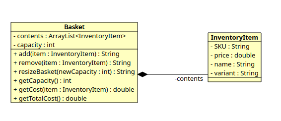
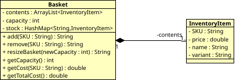

## User Stories

```
1.
As a member of the public,
So I can order a bagel before work,
I'd like to add a specific type of bagel to my basket.
```

```
2.
As a member of the public,
So I can change my order,
I'd like to remove a bagel from my basket.
```

```
3.
As a member of the public,
So that I can not overfill my small bagel basket
I'd like to know when my basket is full when I try adding an item beyond my basket capacity.
```

```
4.
As a Bob's Bagels manager,
So that I can expand my business,
I’d like to change the capacity of baskets.
```

```
5.
As a member of the public
So that I can maintain my sanity
I'd like to know if I try to remove an item that doesn't exist in my basket.
```

```
6.
As a customer,
So I know how much money I need,
I'd like to know the total cost of items in my basket.
```

```
7.
As a customer,
So I know what the damage will be,
I'd like to know the cost of a bagel before I add it to my basket.
```

```
8.
As a customer,
So I can shake things up a bit,
I'd like to be able to choose fillings for my bagel.
```

```
9.
As a customer,
So I don't over-spend,
I'd like to know the cost of each filling before I add it to my bagel order.
```

```
10.
As the manager,
So we don't get any weird requests,
I want customers to only be able to order things that we stock in our inventory.
```

## Domain Model

| Classes       | Members                           | Methods                        | Scenarios                                                                       | Outputs                                                          |
|---------------|-----------------------------------|--------------------------------|---------------------------------------------------------------------------------|------------------------------------------------------------------|
| Basket        | ArrayList<InventoryItem> contents | add(String SKU)                | 1. 3. As a customer add an item to my basket that has space in it               | Success message if the item is successfully added                |
|               | int capacity                      |                                |                                                                                 | Failure message if the basket is full                            |
|               |                                   | remove(String SKU)             | 2. 5. As a customer remove the first instance of a type of item from the basket | Success message if the item is successfully removed              |
|               |                                   |                                |                                                                                 | Failure message if no items of that type are found in the basket |
|               |                                   | resizeBasket(int newCapacity)  | 4. As a manager change the capacity of a basket                                 | Success message if the basket is resized                         |
|               |                                   | get/setCapacity()              |                                                                                 | Failure message if the newCapacity is not a proper size          |
|               |                                   | getCost(String SKU)            | 6. Get the total cost of the items in the basket                                | Total cost of the contents returned                              |
|               |                                   | getTotalCost()                 |                                                                                 |                                                                  |
|               |                                   |                                |                                                                                 |                                                                  |
| InventoryItem | String SKU                        | get/setSKU(String SKU)         |                                                                                 |                                                                  |
|               | double price                      | get/setPrice(double price)     | 7. Get the price of the inventory item                                          | Return the cost of an item from the inventory                    |
|               | String name                       | get/setName(String name)       |                                                                                 |                                                                  |
|               | String variant                    | get/setVariant(String variant) | 8. Add fillings to the bagel (these will show up as other inventory items)      | These will be addable in part 1 above????                        |
|               |                                   |                                | 9. Get the cost of each filling                                                 | These are available as part 7 above?                             |
|               |                                   |                                | 10. Restrict items to stock from the inventory                                  | Success message when available item is added to order            |
|               |                                   |                                |                                                                                 | Failure message when something outside of the list is added???   |


## Class Diagram - First Version



## Class Diagram - Second Version



## Bob's Inventory

| SKU  | Price | Name    | Variant       |
|------|-------|---------|---------------|
| BGLO | 0.49  | Bagel   | Onion         |
| BGLP | 0.39  | Bagel   | Plain         |
| BGLS | 0.49  | Bagel   | Sesame        |
| COFB | 0.99  | Coffee  | Black         |
| COFW | 1.19  | Coffee  | White         |
| COFC | 1.29  | Coffee  | Capuccino     |
| COFL | 1.29  | Coffee  | Latte         |
| FILB | 0.12  | Filling | Bacon         |
| FILE | 0.12  | Filling | Egg           |
| FILC | 0.12  | Filling | Cheese        |
| FILX | 0.12  | Filling | Cream Cheese  |
| FILS | 0.12  | Filling | Smoked Salmon |
| FILH | 0.12  | Filling | Ham           |


In order to be able to only create instances of inventory items that are the same as the ones in the list, in the Basket
class we're going to make a HashMap of the 13 available Inventory Items, with the SKU as a key and also create a copy 
constructor for the InventoryItem class so that it can take one of the existing items and copy it into the basket.

Added toString() methods to each class to make them display nicely.